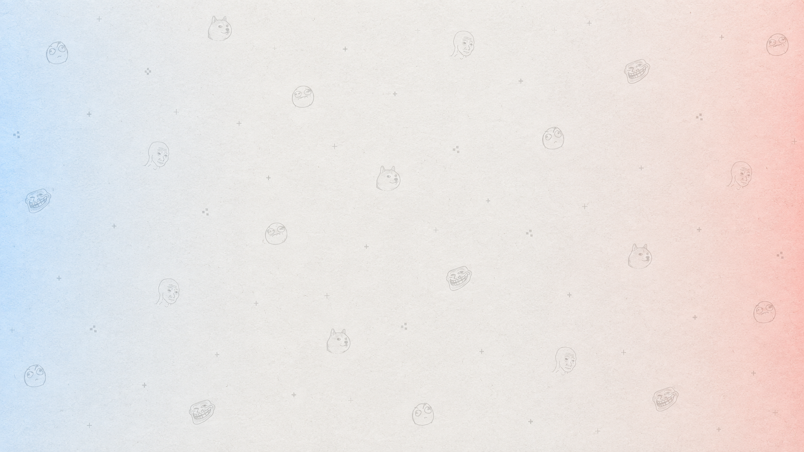
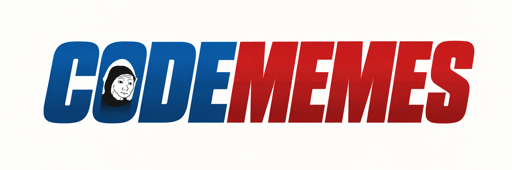
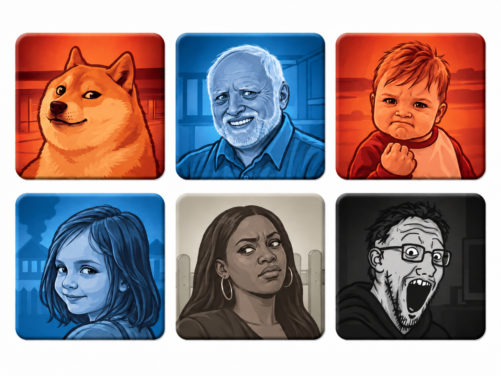

# Design System: Codememes

## Overview

**Creative North Star: "The meme night table."**

Open the room and see the game: twenty-five real-looking cards on a pale off-white playfield, with soft Blue light from the left and Red light from the right. Sparse, faint meme-face line art, tiny plus signs and pixel marks give the background personality while leaving the center quiet. Cream cardstock, printed illustrations, restrained thickness, and soft contact shadows keep the board touchable. Controls are clearly styled interface elements, with white surfaces, dark readable labels, and deliberate Red/Blue accents.

The user's October 5 revision rejects green felt and pins the [supplied background](assets/codememes-background-reference.png). It preserves the physical card-game arrangement, sparse copy, original meme covers, and drag-and-drop lobby, while replacing the surrounding material and control styling. Impeccable informs hierarchy, contrast, interaction, and accessibility within this brief. [PRODUCT.md](PRODUCT.md) owns rules and permissions.

**Status: pale playfield and shared controls implemented; independent review and companion lobby pending.** The five-column board, mixed-media deck, inspector, local selection, accepted identity covers and self-hosted fonts are implemented in #10. Its prior felt screenshots are superseded. #10 implements the playfield and shared controls in this direction; #11 delivers the matching accessible lobby arrangement. References guide original assets and are not shipped as application media.

Use the official [CGE component/rules reference](https://czechgames.com/files/rules/codenames-rules-en.pdf) to understand the physical five-by-five arrangement and covering gesture. Geometry and semantics are the reference; branding, artwork, frames, and composition are original.

The memorable interaction is an accepted reveal: an illustrated identity cover settles onto the selected meme card. The matching lobby gesture picks up a named player piece and places it into a team/role area. Both gestures inhabit the same tabletop world.

## Colors

Use the pale `table` ground across entry, lobby and game. Blue and Red edge glows stay soft, static and outside the central reading area. White `surface` and neutral `surface-edge` belong to controls, pickers and dialogs; cream `card` and `card-edge` belong to physical meme cards. Brick Red and denim Blue identify teams; tan Neutral and charcoal Assassin identify covers. The background watermark is decorative, low contrast and widely spaced, never a competing card or hidden-key cue.

Ink and Muted Ink are readable labels on pale, white and cream surfaces. On-team is for filled red, blue and charcoal controls. Team labels on light surfaces use their deep team color. Do not put pale labels directly on the playfield or dark Ink on filled team controls. Check real rendered contrast and focus at desktop and phone sizes.

Identity combines hue and shape: Red's angular pennant, Blue's round target, Neutral's hollow diamond, and Assassin's skull. Implement a coherent authored vector symbol set alongside raster art, with concise accessible names. Team counts pair a symbol and small Red/Blue label. Card identity labels remain in the inspector and accessibility tree; the board needs no repeated paragraphs of state text.

Selection uses a dark golden `selection-edge` outline and small raised offset, never a team tint. Light Gold remains text selection and the filled-action inset focus cue. Focus is a 3px deep Blue outer outline with 3px offset on light surroundings; filled primary actions add a Gold inset next to their team fill. This keeps focus visible against both surfaces and distinguishable from selection. Errors use a clean white status surface with Ink and brief cause/action; Red remains a team identity.

## Typography

Type serves pieces rather than explanatory text. Bricolage Grotesque at 800 gives phrase cards and the active clue warm printed lettering, and serves as the provisional text wordmark. Atkinson Hyperlegible at 400/700 serves names, inputs, labels, and controls. Self-host required font files and licenses when building; system fallbacks keep play usable while loading. No giant game-screen display heading.

The supplied wordmark example suggests a compact, heavy condensed italic mark: **CODE** in Blue, **MEMES** in Red, with a small monochrome Wojak motif inside the O. Adapt this into original lettering and illustration, using the game's palette and a flat printed treatment. Simplify or omit the face at small sizes so Codememes stays readable. Keep the mark small at the game edge; the example's oversized presentation is not the game layout. This reference does not specify a font or approve final logo artwork.

Phrases retain recognizable spelling, punctuation, and case; do not force uppercase or rewrite them to fit. Image/GIF cards have one canonical recognition name in a cream bottom strip; phrase cards let the phrase occupy the face. Names identify cards, without explaining the joke. Original captions embedded in source memes are content and stay intact.

Names wrap in player pieces or expose the full name on activation. Core labels never shrink below 12px. A long phrase gets a compact readable recognition label on its small face and its complete representation in inspection; ellipsis cannot be the only identifier. Code/count numerals are tabular, with no decorative monospace.

## Layout

### Game first

On desktop the board occupies approximately 70–80% of the useful viewport, centered between compact team/count racks. Target a table width up to 1440px and board around 1040px when room permits. Cards are landscape on roomy screens with a 160px height floor for phrase and corner-control clearance, in five stable columns and rows. Use 12px gaps on roomy screens and 4–6px on phones. Adjust racks/margins before shrinking the board.

A small top edge holds Codememes, room/invite, Rules, and compact presence. The active team's rack gets a clear pointer and accessible turn text. One small white clue slip sits close to the board; the active spymaster's clue form occupies that same space. Operatives get a compact Reveal/End turn tray with the selected card's name/thumbnail. Keep controls outside card content; Reveal remains explicit.

No hero, tagline, welcome paragraph, stats dashboard, large "your turn" heading, permanent roster, instructional sidebar, or repeated "unrevealed/identity hidden" labels. The board dominates the first viewport. Remaining text has a job: meme content, recognition names, players, counts/team labels, clue, controls, and brief recovery. Extended roster and Rules are opened explicitly.

The game centers a board up to 1040px wide. Portrait view keeps five columns and 12px minimum card names, allowing vertical scrolling and a sticky explicit action tray. The inspector shows uncropped media and attribution; GIF Play is explicit and Pause/Stop returns its poster. Original generated covers and cardstock live under `public/art/table-v1`; [shipping-art.json](assets/shipping-art.json) holds exact prompts and reference roles. Unused felt is removed from shipping assets. Original decorative SVG linework lives in `public/art/table-v1/playfield.svg` (3.5% stroke opacity, 960 by 720px repeat); CSS supplies static edge light. The compact adapted mark uses original Bricolage lettering in the deep Blue/Red colors, omitting the face motif at this small size. Board identity symbols are authored SVG geometry independent of illustration.

UI hover surfaces use subtle neutral or team-tinted fills with dark text. Small tools use 12/13/14px steps; count numerals use 20/26px and full inspector phrases reach 44px. Dialog backdrops use `rgb(27 31 44 / 0.55)`. Neutral hover uses `#eef2f8`, Blue/Red areas `#eaf2f9`/`#f8eceb`; compact entry uses a 12px radius and `0 6px 20px rgb(27 31 44 / 0.10)` shadow. Existing native lobby headings use 1.35rem; 2px mini-mark geometry is dormant. These and the 12/13/14px small-tool steps, 20/26px counts, 44px inspector text are intentional detector advisories. Record any final implementation-specific tones with their contrast roles; do not retain pale on-felt label colors on the new light playfield.

The private spymaster view keeps readable meme faces with an identity edge tab and distinct symbol from the permitted server snapshot, plus one small Spymaster marker. Do not cover all memes with portraits before reveal or render a key for public clients and hide it with CSS.

### Phones and tablets

Keep five columns and stable positions; no carousel or team-based reordering. Below about 900px move team racks into one compact row. At 320px, 8px page margins and 4px gaps leave roughly 58px-wide faces 190px high, with 180px at tablet width and a 160px floor on desktop. This taller phone silhouette leaves a readable recognition name. Full captions and details belong in inspection.

On desktop, each card has an explicit magnify control separate from card selection: the face selects when guessing is permitted; magnify only inspects. Below 540px, the whole card opens inspection, so a roughly 58px-wide face does not have to contain two competing 44px targets. The phone inspector offers a separate 44px Select action to permitted operatives; choosing it sets the local preview and closes inspection. The global Reveal remains a separate explicit action. Every inspect/select control has a reachable 44px target with no overlap.

The inspector displays full media/poster, recognition name, optional GIF Play/Pause, and Close. Opening or playing media never selects a card. Public users never receive private identities there. Escape closes and restores opener focus; explicit Select returns focus to the selected board position.

Allow vertical scrolling in narrow portrait layouts; keep the action tray reachable without hiding the last row. Never shrink to unreadable stamps just to force five rows above the fold. Landscape/tablet views use available width; rotation is optional.

### Entry and lobby

Entry uses the continuous pale playfield and a compact white Create/Join surface: small split-color Codememes mark, clear mode controls, labeled name/code fields, and one prominent action. Use Red/Blue accents and styled controls, without promotional copy or a demo board competing with entry.

The lobby is a team arrangement table. Red/Blue areas sit side by side on desktop, each with one named Spymaster slot above its Operatives area. Unassigned/watch pieces use a shared shallow tray. Player pieces are compact name tags with generic avatar/initials, a handle, presence dot, and host mark. No profile or avatar service.

Stack team areas on phones with persistent labels. Handle dragging near an edge scrolls the page; ordinary swipes still scroll. Tap-to-place offers a short destination menu so moving across the entire page is unnecessary. Keyboard placement has named destinations, visible focus, Escape cancellation, and accepted-move announcements.

Only authorized pieces lift. Pending placement shows a temporary destination ghost while accepted placement remains discernible; acceptance settles it, rejection restores it with one short reason. An occupied spymaster slot rejects without swapping. Concurrent moves, disconnects, and host changes resolve through latest server state.

Room code/Copy invite stay at the edge. Start sits between/below teams and becomes available under existing readiness rules. Missing seats are signaled in their slot, such as "Needs spymaster," with a compact reason available for disabled Start. Long role descriptions belong in Rules.

## Elevation & Depth

Depth represents pieces: faint cardstock edge, soft downward resting shadow, stronger picked-up shadow, and cover laid over the face after reveal. Target `0 2px 4px rgb(27 31 44 / 0.16)` at rest and `0 10px 18px rgb(27 31 44 / 0.22)` while lifted. Clean controls have restrained borders and small shadows. Edge light belongs to the background; do not give individual controls luminous halos, glass, or hard block shadows.

Use a static decorative SVG tile with original simplified troll/reaction/Doge/Wojak-style line faces and small plus/pixel marks, as explicitly requested by the user. Keep faces approximately 40–70px, widely spaced and around 2–4% opacity; reduce their visibility beneath cards and controls. CSS radial gradients provide the subtle edge light. A faint paper-grain raster is optional; it must remain almost invisible and have recorded provenance. Cardstock grain stays on cards. Media retains its own colors without team tinting. Decorative assets have no interaction or accessible content and never encode room/card identity.

## Shapes

Cards/covers share 10px corners and aligned landscape silhouettes. Controls use 8px; small movable player pieces may be pill-shaped. The table is continuous, not a giant rounded container inside another card.

Keep pieces straight at rest. A 2-degree lift may accompany a drag; random board rotation adds no clarity. Focus, selection, loading, and reveal preserve geometry/hit areas. The cream recognition strip remains real readable text when a cover arrives.

## Components

### Meme faces and inspection

One geometry holds three forms: a printed phrase; an image with name strip; or a GIF poster with name strip and inspect/play affordance. Use `object-fit: contain` to preserve recognition-critical captions/faces. Curated cream padding fills remaining space. [MEME-DECK.md](MEME-DECK.md) keeps representations recognizable and stable.

Load stills/posters first. GIF playback is explicit, muted, and controllable in the inspector. Reduced motion starts with stills and leaves playback optional. Failed media falls back to the canonical phrase/name in the same geometry, with no broken-image icon or substitute reference. Inspection stays available to watchers/spymasters and for revealed cards.

### AI-generated identity covers

Generate four original meme-character cover families: Red agent, Blue agent, Neutral bystander, and Assassin. Follow the physical pieces' portrait-led composition: a large head-and-shoulders character, expressive face, bold ink outlines, broad areas of color, and a quiet background. One recognizable reaction establishes the joke. Avoid elaborate scenery, tiny props, ornamental inset frames, and captions. One strong master per family is enough initially; variations must preserve immediate category recognition.

The attached meme-cover sheet is the primary style reference. Its large expressive faces, strong outlines, layered flat shading, simple scene hints, and color across the whole piece establish the intended treatment. The [physical portrait reference](assets/physical-cover-reference.png) and [physical board reference](assets/physical-board-reference.png) from **Generate Meme Tokens** provide secondary context. [Source provenance](assets/token-reference-sources.json) records the supplied examples and their reference-only status.

| Family   | Art direction                                                                                                                                                                                                                                                                |
| -------- | ---------------------------------------------------------------------------------------------------------------------------------------------------------------------------------------------------------------------------------------------------------------------------- |
| Red      | A recognizable meme/reaction portrait, predominantly Red across both character and background. Keep pale highlights small so the whole piece still reads Red.                                                                                                                |
| Blue     | A different recognizable meme/reaction portrait, predominantly Blue across both character and background. Use the same linework and print treatment as Red.                                                                                                                  |
| Neutral  | A deadpan everyday reaction portrait with a broad tan field and muted illustration. Keep it visibly distinct from the two teams.                                                                                                                                             |
| Assassin | A Wojak-style reaction portrait against a predominantly near-black field, with restrained gray/cream facial lines. It must read as the black piece even at phone-card size; a small dark border around a pale face is insufficient. Keep the separate skull identity symbol. |

Red, Blue, and Neutral character choices remain open for asset generation. The sheet demonstrates recognizable meme characters rather than generic animals with meme-like props; preserve that direct recognition when choosing the cast. The source conversation's latest Assassin refinement calls for Wojak. The black reaction portrait demonstrates the required dark treatment, while the hooded face in the wordmark offers another character cue. Adapt the drawing, pose, scene, and card finish; the exact characters, pairings, and pixels in these examples are not final assets or fixed allegiances for playable memes.

For implementation produce separate full-frame landscape covers in the board's geometry, without baked-in shadows, UI text, category symbols, or sheet gutters. Recompose the square portrait examples for this landscape frame; do not stretch their faces. Apply edges, shadows, symbols, and readable recognition strips as reusable semantic layers. Judge each cover at its actual desktop and phone sizes: the category should be immediately clear, the face recognizable, and detail subordinate to both. Record the exact generation prompt and source references with each resulting asset.

The [earlier generated contact sheet](assets/codememes-token-reference.png) and its [prompt provenance](assets/codememes-token-reference.png.json) remain historical exploration. Its detailed scenes, decorative frames, animal cast, and skeleton Assassin are superseded by this portrait brief.

Do not trace commercial agent portraits or recreate branded frames. Do not synthesize a "real" meme image when exact recognition matters: board memes use their curated phrase or approved source; generated art serves original covers/materials. Cover identity is independent of the meme below.

An accepted reveal lays the cover over the upper face in a 180ms downward settle with `cubic-bezier(0.16, 1, 0.3, 1)`. Keep the recognition strip readable. Counts/identity change only on server acceptance, never while pending. Reduced motion makes placement immediate with the same concise announcement.

### Controls, state, and endings

Clean white controls use short labels, clear borders, and 44px minimum hit targets. Filled Blue/Red actions, team-tinted regions and deliberate spacing establish hierarchy; secondary controls remain neutral. Inputs have real labels, themed caret/selection, and readable placeholders. Tooltips supplement accessible names; touch users can discover all actions. Keep physical simulation on cards, covers and movable pieces rather than disguising every UI control as cardstock.

Selection stays local and clears on connection loss or revision/round change. Pending disables repeats. Reconnection, absent spymaster, takeover, rejection, and expiry show only when relevant in one compact white status surface. Preserve accepted board while paused. Sparse copy does not remove actionable recovery.

The final board receives all identities from the server and stays on the table. Put "Red wins"/"Blue wins" near its rack, with outcome available and host Play again following the board. Accepted lobby return removes board/clue/private state and focuses the roster. Host abandonment belongs in the absent-spymaster state with compact explicit confirmation that it discards this board and keeps the group.

Rules uses a small modal with protected reading focus, Escape/Close, and focus restoration. Inspection uses a modal/full-screen sheet for readable media and a separate focus context. Ordinary arrangement and turns stay on the table.

## Do's and Don'ts

- Let pieces occupy the screen; avoid a marketing/dashboard shell.
- Use the approved pale background with soft Red/Blue edge light and sparse meme faces; never reintroduce green felt.
- Style controls as clean, readable UI while keeping the real-game board and illustrated covers.
- Put humor in cards and art, keeping essential action labels literal.
- Keep names, clue, counts, and recovery readable; minimal copy still carries necessary information.
- Preserve positions, private/public boundaries, deliberate Reveal, and accepted-state feedback.
- Give dragging equivalent tap and keyboard paths. [WCAG dragging guidance](https://www.w3.org/WAI/WCAG22/Understanding/dragging-movements/) requires a single-pointer alternative; keyboard access is separately required.
- Respect [reduced motion](https://developer.mozilla.org/en-US/docs/Web/CSS/Reference/At-rules/@media/prefers-reduced-motion), keep content inspectable, and test the real deck at 320px.
- Record provenance and optimize media, covers, and material before shipping.
- Never autoplay a wall of GIFs, reveal by inspection, encode a key in media, or claim the companion lobby or deployment already exists.
